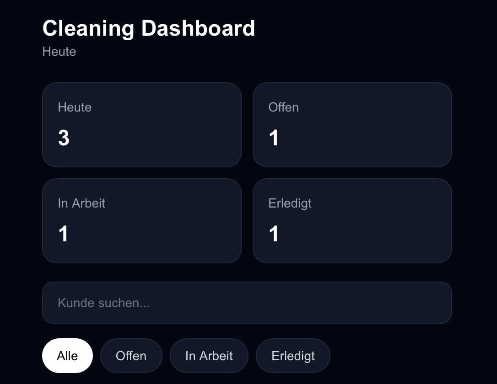
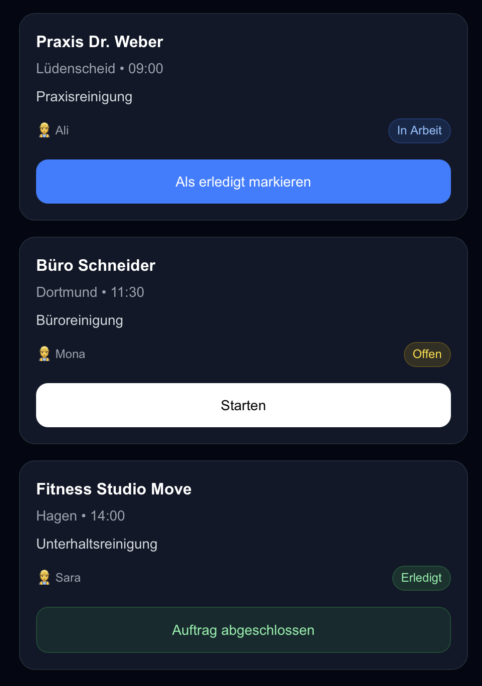

# 🧹 Cleaning Dashboard

A mobile-first operations dashboard built for cleaning companies — designed to manage jobs and track daily work in a simple, clean interface.

---

## 📋 Overview

Cleaning Dashboard is a modern web application that helps cleaning companies manage their daily jobs more efficiently.

The focus of this project is a simple, mobile-friendly interface that allows users to:

- view jobs
- track progress
- update job status
- filter and search tasks

---

## ✨ Key Features

- Mobile-first design
- Job list view
- Status updates (Offen, In Arbeit, Erledigt)
- Search functionality
- Status filtering
- Dashboard stats
- Dark UI

---

## 🛠️ Tech Stack

- Next.js
- TypeScript
- React
- Tailwind CSS

---

## 📸 Screenshots

(Add later)

---

## 🚀 Installation

git clone https://github.com/FerasHB/cleaning-dashboard.git  
cd cleaning-dashboard  
npm install  
npm run dev  

---

## 📁 Project Structure

app/  
components/  
data/  
public/  

---

## 🎯 Goal

Build a simple, real-world dashboard with clean UI and mobile-first design.

---

## 🔮 Future Improvements

- Auth system  
- Backend  
- Notifications  
- Role system  

---

## 👤 Author

Feras Hababa  
https://github.com/FerasHB

## 📸 Screenshots

